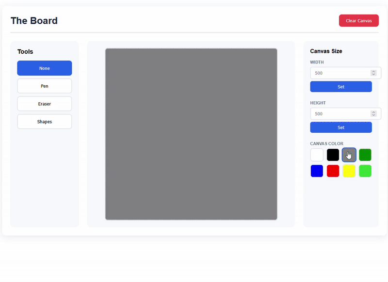

# Drawing Board Module (my-board)

A customizable web component for creating an interactive drawing canvas in your web applications. Built with vanilla JavaScript and Web Components, this module provides a complete drawing experience with pen tools, erasers, and extensive customization options.



## Features

- **Drawing Tools**: Freehand pen tool with customizable colors and sizes
- **Eraser Tool**: Clean up your canvas with precision
- **Canvas Resizing**: Adjust canvas dimensions on-the-fly
- **Interactive UI**: Intuitive toolbar with visual controls
- **Programmatic API**: Full control via JavaScript methods
- **Responsive Design**: Adapts to different screen sizes
- **Zero Dependencies**: Pure vanilla JavaScript implementation

## Installation

### Basic Setup

1. Include the module in your HTML file:

```html
<!DOCTYPE html>
<html lang="en">
<head>
  <meta charset="UTF-8">
  <meta name="viewport" content="width=device-width, initial-scale=1.0">
  <title>My Drawing Board</title>
</head>
<body>
  <script type="module" src="./src/js/index.js"></script>
</body>
</html>
```

2. In your JavaScript file (for example, `src/js/index.js`):

```js
import '../components/board/board.js'

const board = document.createElement('my-board')
document.body.appendChild(board)
```

### Direct HTML Usage

Alternatively, you can add the component directly in your HTML:

```html
<script type="module">
  import './src/components/board/board.js';
</script>

<my-board></my-board>
```

## Usage

### Quick Start

Create a basic drawing board with default without adding settings:

```js
import '../components/board/board.js'

const board = document.createElement('my-board')
document.body.appendChild(board)
```

### Full Configuration Example

Customize the board with your preferred settings:

```js
import '../components/board/board.js'

const board = document.createElement('my-board')
document.body.appendChild(board)

// Set custom canvas dimensions (default: 500x500)
board.setCanvasSize(500, 500)

// Configure pen color palette of your choice (up to 12 colors)
board.setPenColor(
  'black', 'white', 'violet', 'yellow', 
  'lime', 'green', 'blue', 'blueviolet', 
  'brown', 'grey', 'orange', 'red'
)

// Configure canvas background color options (up to 8 colors)
board.setCanvasColor(
  'white', 'black', 'grey', 'green', 
  'blue', 'red', 'yellow', 'limegreen'
)

// Set pen size options: small, medium, large
board.setPenSize(3, 6, 10)
```

## API Reference

### Methods

#### `setCanvasSize(width, height)`

Sets the canvas dimensions programmatically.

**Parameters:**
- `width` (number): Canvas width in pixels
- `height` (number): Canvas height in pixels

**Example:**
```js
board.setCanvasSize(1000, 800)
```

---

#### `setPenColor(...colors)`

Configures the available pen color options.

**Parameters:**
- `...colors` (string): Variable number of color values (CSS color names, rgb)
- Maximum: 12 colors

**Example:**
```js
board.setPenColor('#FF0000', 'black', '#0000FF', 'rgba(255, 0, 0, 0.5)')
```

---

#### `setCanvasColor(...colors)`

Configures the available canvas background color options.

**Parameters:**
- `...colors` (string): Variable number of color values
- Maximum: 8 colors

**Example:**
```js
board.setCanvasColor('white', '#f0f0f0', 'black')
```

---

#### `setPenSize(...sizes)`

Configures the pen size options (small, medium, large).

**Parameters:**
- `...sizes` (number): Three size values in pixels
  - First parameter: Small size
  - Second parameter: Medium size
  - Third parameter: Large size

**Example:**
```js
board.setPenSize(2, 6, 10)
```

## User Interface

### Toolbar Controls

The component provides an intuitive sidebar with the following controls:

- **Tool Selection**: None, Pen, Eraser, Shapes (shapes coming soon)
- **Pen Settings** (visible when pen is active):
  - Color picker with customizable color palette
  - Size selector (Small, Medium, Large)
- **Canvas Controls** (right sidebar):
  - Width and height input fields
  - Canvas background color selector

### Additional Features

- **Clear Canvas Button**: Located in the header, clears the entire canvas with one click
- **Responsive Layout**: Automatically adjusts for mobile devices

## Use Cases

1. **Digital Sketching**: Create quick sketches and drawings in web applications
2. **Educational Tools**: Build interactive learning materials with drawing capabilities
3. **Whiteboard Applications**: Implement collaborative drawing features
4. **Tactical Board**: Use the component as a base for a football tactics board
5. **Art Applications**: Develop simple drawing and painting tools
6. **Annotation Tools**: Add drawing capabilities to image or document viewers
7. **Game Development**: Create drawing-based mini-games or puzzles

## File Structure

```
src/
├── components/
│   └── board/
│       ├── board.js              # Main component logic
│       ├── board-template.js     # HTML template and styles
│       └── index.js              # Module entry point
├── tools/
│   ├── pen/
│   │   └── pen.js               # Pen tool implementation
│   └── eraser/
│       └── eraser.js            # Eraser tool implementation
└── js/
    └── index.js                 # Application entry point
```


## License

This module is licensed under the **MIT License**. You are free to use, modify, and distribute it for personal or commercial purposes.

## Future Enhancements

- Shape drawing tools (rectangle, circle, line)
- Undo/redo functionality
- Save and export drawings (PNG, SVG)
- Touch device support
- Color picker with custom color input
- Image import functionality

---

---

## Installation

 1. Run git clone https://github.com/IsakThornqvist/Assignment-L2.git in the terminal

 2. Run cd Assignment-L2 in the terminal
 
 3. Run npm install in the terminal

 4. Run npm run dev in the terminal and open the project in the browser